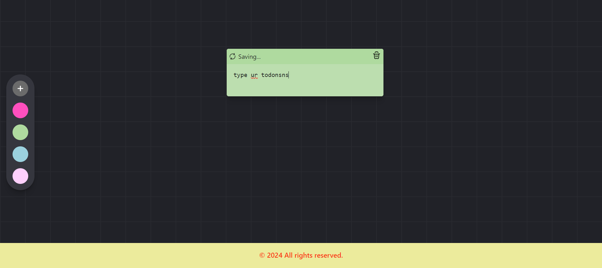

## Note Flex App
- [Go Live](https://noteflex.vercel.app/)
# Sticky Notes App
This is a sticky notes application where users can add notes, change note colors, and drag-and-drop notes to any position on the screen. The positions of the notes are saved to a database. The application is built with React for the frontend and Appwrite for the backend.

## Features

- Add new sticky notes
- Change the color of each note
- Drag and drop notes to rearrange them
- Save the position of each note in the database
- User can delete thier notes

## Tech Stack

- **Frontend**: React
- **Backend**: Appwrite

## Installation

## Images

